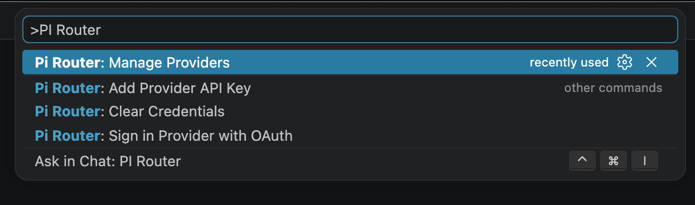
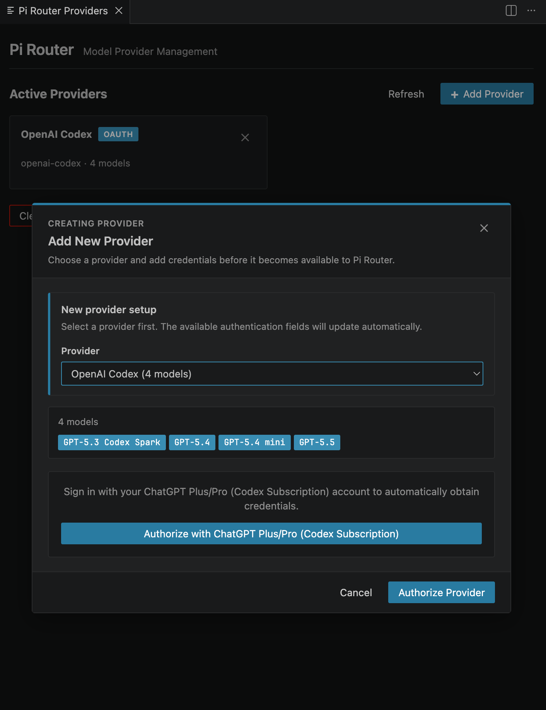

<p align="center">
  <a href="./assets/icon.svg">
    
  </a>
</p>

# Pi Router

Pi Router provides custom VS Code chat models through Pi.

Pi Router is a VS Code extension that exposes models supported by `@earendil-works/pi-ai` through the VS Code Language Model Chat API.

The extension reads provider credentials configured in VS Code SecretStorage and registers models from configured providers under the `pi-router` vendor. It supports API keys as well as OAuth providers supported by `pi-ai`.

## Download

Install Pi Router from the [VS Code Marketplace](https://marketplace.visualstudio.com/items?itemName=tbxark.pi-router).

## Requirements

- VS Code `1.125.0` or later
- Node.js `22` or later
- pnpm `11.7.0` or a compatible version

## Install Dependencies

```sh
pnpm install
```

If pnpm is not installed locally, enable Corepack first:

```sh
corepack enable
corepack prepare pnpm@11.7.0 --activate
```

## Build

Compile TypeScript and copy the configuration panel HTML:

```sh
pnpm run compile
```

Generate the extension entry bundle:

```sh
pnpm run bundle
```

Package as a VSIX:

```sh
pnpm run package:vsix
```

After packaging, the following file is generated in the repository root:

```txt
pi-router.vsix
```

You can also package and install it directly into the current VS Code instance:

```sh
pnpm run install:vsix
```

## Usage

1. Install the VSIX, then reload VS Code.
2. Open the command palette and run `Pi Router: Manage Providers`.
3. Select a provider, then save the API key or provider environment variables.
4. If the provider supports OAuth, click the authorization button in the same configuration panel to sign in.
5. After configuration, extensions that support the VS Code Language Model Chat API can discover and use models under the `pi-router` vendor.

Available commands:

- `Pi Router: Manage Providers`: open the provider management panel
- `Pi Router: Add Provider API Key`: quickly save an API key for a provider
- `Pi Router: Sign in Provider with OAuth`: sign in to supported providers with OAuth
- `Pi Router: Clear Credentials`: clear all credentials saved by the extension

Credentials are stored in VS Code SecretStorage and are not written to repository files.




## Icon

The source icon file is [`assets/icon.svg`](./assets/icon.svg). The extension manifest uses [`assets/icon.png`](./assets/icon.png), exported from that SVG, to meet the VS Code Marketplace/VSIX extension icon format requirements.

## License

This project uses the MIT License. See [`LICENSE`](./LICENSE) for details.
